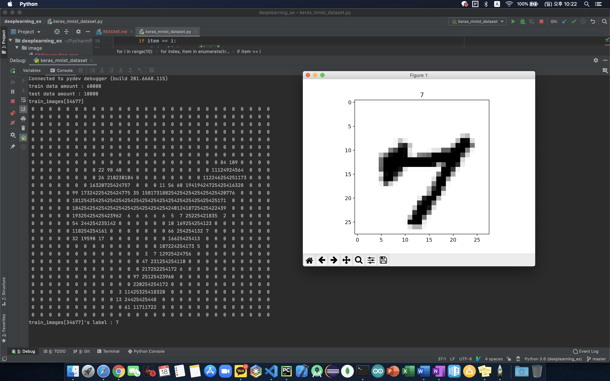
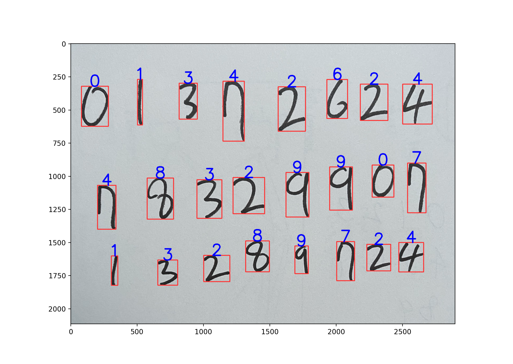
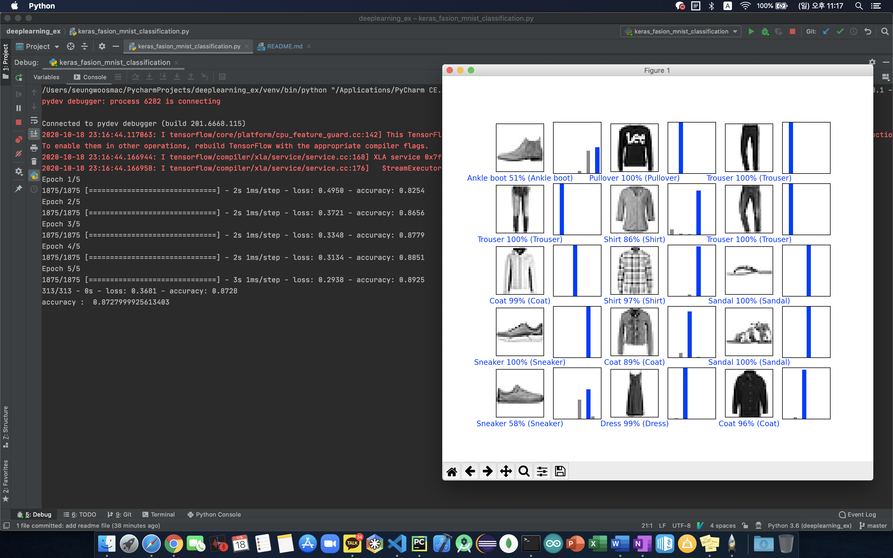
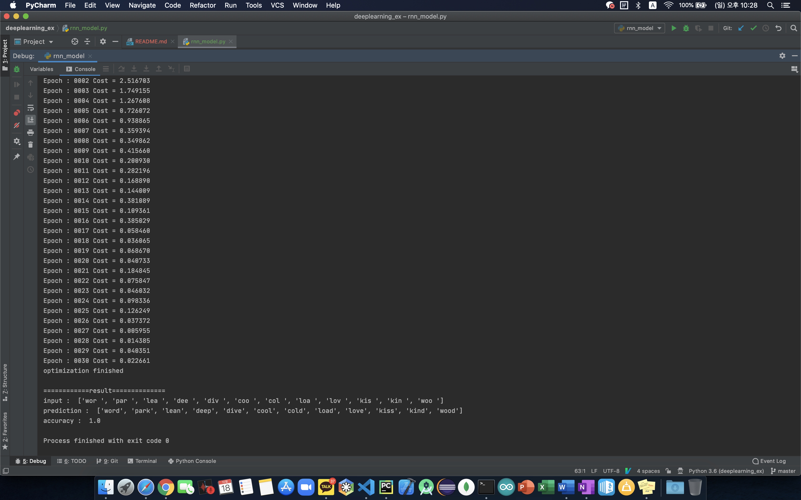

# Deep learning Stydy
> this repo was made for study CNN, RNN, etc...
> ### Check datas in mnist dataset
> > check how many datas included, image pixels, etc...
> > * __execution screen__
> > 
> > * __relative file__
> >   - keras_mnist_dataset.py
>
> ### CNN
> > train model using Mnist dataset and detect handwriting number
> > * __execution screen__
> > 
> > * __relative files__
> >   - keras_CNN_mnist.py
> >   - keras_model_predict.py
>
> ### Fashion mnist
> > train model using Fashion mnist dataset and predict some datas.
> > * __execution screen__
> > 
> > * __relative file__
> >   - keras_fashion_mnist_classification.py
>
> ### RNN
> > I wanted to study NLP so, I used RNN simply
> > * __execution screen__
> > 
> > * __relative file__
> >   - rnn_model.py
>
> ### GAN
> > I wanted to study GAN. but I can't make it.. 
> > I followed the GAN example, and I wrote same codes.
> > I'll study more about GAN
> > * __relative file__
> >   - gam_make_gif.py
>
> ### Plan
> > I wanna study more techniques in deeplearning.
> > * __Want to learn list__
> >   - GAN
> >   - LSTM
> >   - apply models in js script
> >   - reinforcement learning
> >   - etc..